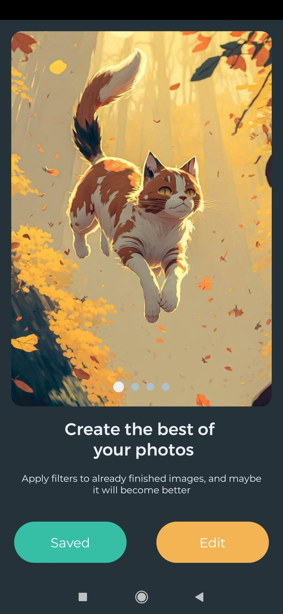
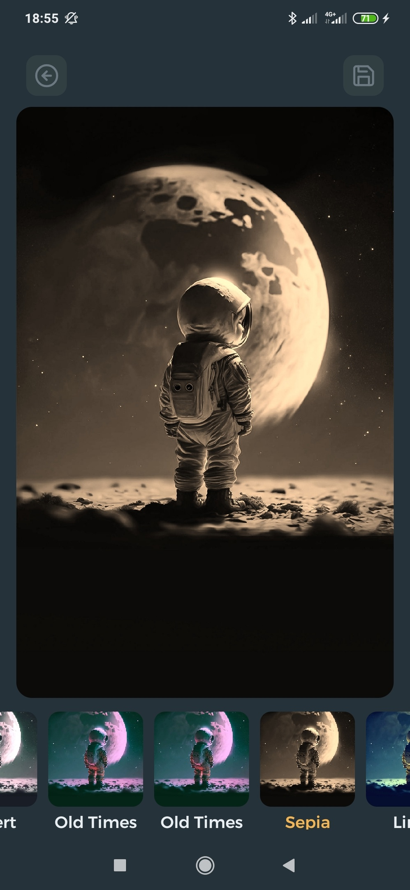
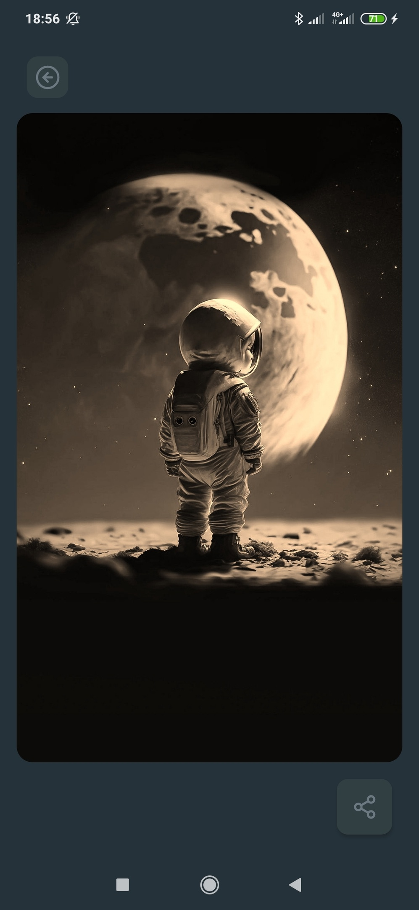
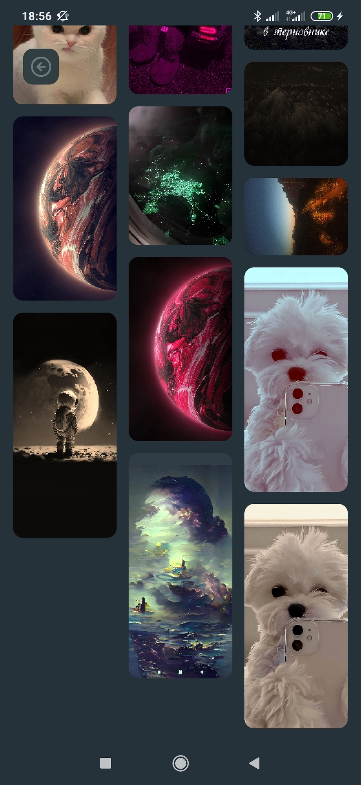

# Filterz [MVVM, Koin, Glide]
This repository is made according to the course, to improve the skills of applying the pattern in practice

## Screenshots
Screenshot of each window

</img>
</img>

</img>
</img>

## Structure

#### Model
The model is presented in the form of two repositories that provide suspend functions for receiving data
- `EditImageRepositoryImpl` - provides filters for photos
- `SavedImageRepositoryImpl` - provides already saved photos after processing

#### View
View are classic activities
- `Activity` 
- `Adapter`
  
#### ViewModel
ViewModels contain the logic of their screens
 - `EditImageViewModel`
 - `SavedImageViewModel`
